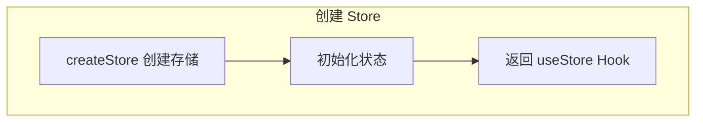
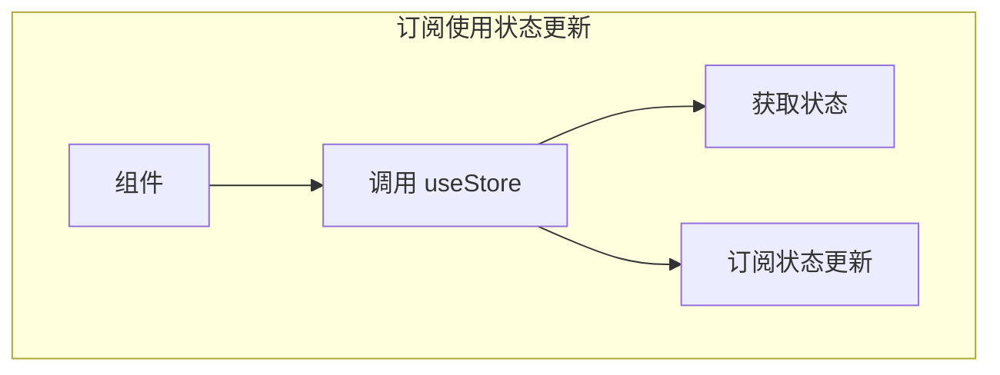
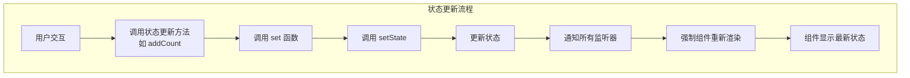

```mermaid
graph TD
    A[createStore 创建存储] --> B[初始化状态]
    B --> C[返回 useStore Hook]

    subgraph 创建 Store
    A
    B
    C
    end

```

```mermaid
graph TD
    D[组件] --> E[调用 useStore]
    E --> F[获取状态]
    E --> G[订阅状态更新]

    subgraph 订阅使用状态更新
    D
    E
    F
    G
    end
```

```mermaid
graph TD
    H[用户交互] --> I[调用状态更新方法<br/>如 addCount]
    I --> J[调用 set 函数]
    J --> K[调用 setState]
    K --> L[更新状态]
    L --> M[通知所有监听器]
    M --> N[强制组件重新渲染]
    N --> O[组件显示最新状态]

    subgraph 状态更新流程
    H
    I
    J
    K
    L
    M
    N
    O
    end
```

